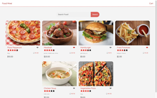
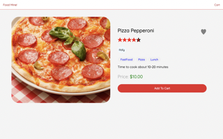
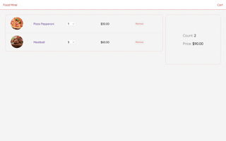

# Foodstore UI

### Screen Shots

_Main Page_

_Food Description Page_

_Cart Page_

---

### Table of Contents

- [Description](#description)
- [Author Info](#author-info)

---

## Description

- A simple online food store user interface I built using AngularJS!
- User can view the description of a food, search for their food in main page, and add their wanted food to cart

#### Technologies

- AngularJS
- TypeScript
- HTML
- CSS

---

### How to use:

- Clone the project to your computer
- Run `npm install` or `yarn add` to install the packages
- Run `ng serve` to start the project

---

### What I Learned:

- Setting up and developing an Angular project
- How Angular components and routing work

---

[Back To The Top](#Foodstore-UI)
